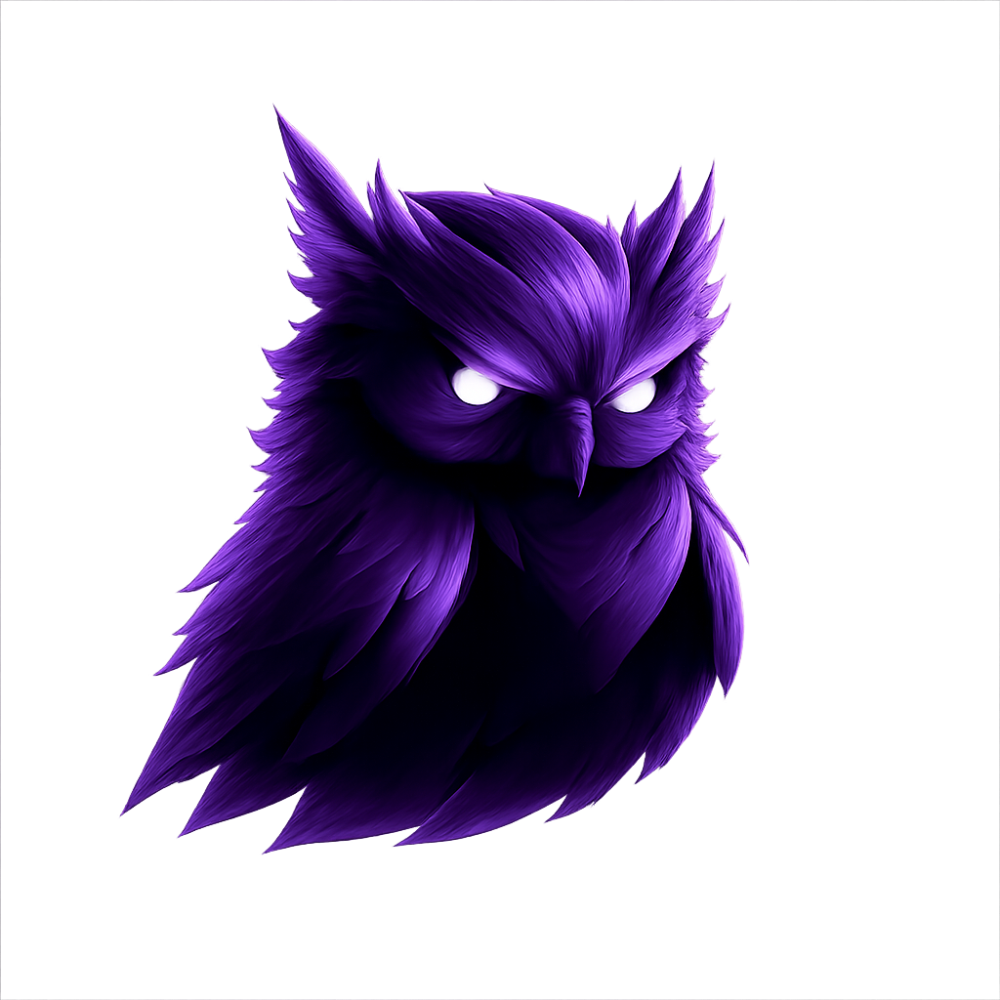

<div align="center">
  
  <h1>Controlyze</h1>
  <p><strong>Self-hosted Docker monitoring dashboard</strong> for viewing container logs, health/status, resource usage, alerts, incidents, and public status pages.</p>

  
  
  
  
</div>

---

## ✨ Features

### Core Monitoring
- **Container Monitoring** - Real-time container status, health checks, and restart tracking
- **Log Viewer** - Live tail and historical logs with regex search and severity highlighting
- **Metrics Dashboard** - CPU, memory, network, and I/O metrics per container
- **Event Timeline** - Docker events with correlation to alerts and incidents
- **Stack Detection** - Auto-detect Docker Compose projects

### Alerting & Incidents
- **Advanced Alert Rules** - Configurable alerts with multiple condition types:
  - `health_status` - Container health state changes
  - `container_status` - Container stopped/paused/dead detection
  - `restart_count` - Restart loop detection with configurable thresholds
  - `resource_threshold` - CPU/memory percentage alerts
  - `log_pattern` - Regex pattern matching on container logs
- **Container Filtering** - Target specific containers with wildcard support (e.g., `plex`, `*arr`, `flaresolverr*`)
- **Deduplication** - Per-alert dedup windows to prevent notification spam
- **Duration-based Conditions** - Time-based persistence before triggering
- **Incident Management** - Group alerts, track lifecycle (Open → Investigating → Resolved)

### Integrations
- **Discord Notifications** - Rich embed alerts with severity colors and container details
- **Linear Ticketing** - Auto-create tickets from incidents
- **Webhook Support** - Custom webhook integrations

### Public Status Page
- **Public Status Page** - Beautiful public-facing status page at `/status`
- **Custom Domain Support** - Host your status page on a subdomain (e.g., `status.example.com`)
- **Service Grouping** - Organize services by category (Media, Indexing, Infrastructure, etc.)
- **Impact Levels** - Critical, Major, Minor severity for each service
- **Per-Container Control** - Enable/disable individual containers from the status page
- **Uptime Tracking** - Historical uptime percentages (24h, 7d, 30d)
- **Incident Display** - Show active and resolved incidents on the status page

### Authentication
- **Built-in Auth** - Local username/password authentication
- **Session Management** - Secure cookie-based sessions
- **Status Page Bypass** - Public status page accessible without login

### SchroStack Profile
- **Media Server Support** - Built-in detection for Plex, Jellyfin, Sonarr, Radarr, etc.
- **Service Grouping** - Auto-categorize Media, Indexers, Automation, Infrastructure
- **Predefined Alerts** - Smart defaults for common media server issues

## Tech Stack

- **Framework**: Next.js 15 (App Router)
- **Language**: TypeScript
- **Styling**: TailwindCSS 4
- **UI Components**: ShadCN UI
- **Database**: SQLite (Drizzle ORM)
- **Docker API**: dockerode
- **Configuration**: YAML

## 🚀 Quick Start

### Docker (Recommended)

```yaml
services:
  controlyze:
    image: ghcr.io/moderniselife/controlyze:latest
    container_name: controlyze
    restart: unless-stopped
    user: "1001:1001"
    group_add:
      - "${DOCKER_GID:-999}"
    ports:
      - "3100:3000"
    volumes:
      - /var/run/docker.sock:/var/run/docker.sock:ro
      - ./data:/app/data
    environment:
      - TZ=Your/Timezone
      - DISCORD_WEBHOOK_URL=${DISCORD_WEBHOOK_URL}
      - LINEAR_API_KEY=${LINEAR_API_KEY}
      - LINEAR_TEAM_ID=${LINEAR_TEAM_ID}
      - ADMIN_PASSWORD_HASH=${ADMIN_PASSWORD_HASH}
```

### From Source

#### Prerequisites
- Node.js 18+ or Bun
- Docker running locally or accessible via TCP/SSH

#### Installation

```bash
# Clone the repository
git clone https://github.com/moderniselife/controlyze.git
cd controlyze

# Install dependencies
bun install

# Generate database
bun run db:generate
bun run db:push

# Start development server
bun run dev
```

Open [http://localhost:3000](http://localhost:3000) in your browser.

#### Production Build

```bash
# Build for production
bun run build

# Start production server
bun run start
```

## ⚙️ Configuration

Controlyze can be configured via the web UI or a YAML config file at `./data/controlyze.yml`.

### Example Configuration

```yaml
version: "1"

docker:
  connection:
    type: socket
    socketPath: /var/run/docker.sock

stacks:
  profiles:
    schrostack:
      enabled: true
      services:
        media: [plex, jellyfin, tunarr, overseerr, tautulli]
        indexers: [prowlarr, jackett, flaresolverr*]
        automation: [schrodrive, watchtower, pd_zurg]
        infrastructure: [cloudflare-tunnel, gluetun]

alerts:
  rules:
    # Generic alerts for all containers
    - name: container_unhealthy
      enabled: true
      condition:
        type: health_status
        status: unhealthy
        duration: 30s
      severity: warning
      routing:
        discord: true

    # Container-specific alerts
    - name: plex_down
      enabled: true
      description: "Plex media server is not running"
      condition:
        container: plex
        type: container_status
        status: exited
      severity: critical
      routing:
        discord: true
        autoTicket: true

    - name: zurg_mount_failed
      enabled: true
      condition:
        container: pd_zurg
        type: health_status
        status: unhealthy
        duration: 60s
      severity: critical
      routing:
        discord: true

    # Resource monitoring
    - name: plex_high_memory
      enabled: true
      condition:
        container: plex
        type: resource_threshold
        metric: memory_percent
        threshold: 85
        duration: 5m
      severity: warning

    # Log pattern matching
    - name: schrodrive_errors
      enabled: true
      condition:
        container: schrodrive
        type: log_pattern
        pattern: "(?i)(error|failed|exception)"
        excludePattern: "(?i)(retry|expected)"
      severity: warning
      dedupWindow: 10m

  defaults:
    cooldown: 5m
    dedupEnabled: true

discord:
  enabled: true
  webhookUrl: ${DISCORD_WEBHOOK_URL}

ticketing:
  provider: linear
  linear:
    apiKey: ${LINEAR_API_KEY}
    teamId: ${LINEAR_TEAM_ID}

auth:
  enabled: true
  provider: local
  local:
    users:
      - username: admin
        passwordHash: ${ADMIN_PASSWORD_HASH}

statusPage:
  enabled: true
  title: "System Status"
  domain: status.example.com

ui:
  theme: dark
  refreshInterval: 5s
```

### Environment Variables

| Variable | Description |
|----------|-------------|
| `DATABASE_PATH` | SQLite database path (default: `./data/controlyze.db`) |
| `CONFIG_PATH` | Configuration file path (default: `./data/controlyze.yml`) |
| `DISCORD_WEBHOOK_URL` | Discord webhook URL for alerts |
| `LINEAR_API_KEY` | Linear API key for ticketing |
| `LINEAR_TEAM_ID` | Linear team ID |
| `ADMIN_PASSWORD_HASH` | Bcrypt hash of admin password |
| `AUTH_DISABLED` | Set to `true` to disable authentication |
| `STATUS_PAGE_DOMAIN` | Domain for status page (alternative to YAML config) |

## 📄 Pages

| Page | Description |
|------|-------------|
| `/` | Overview dashboard with health summary |
| `/login` | Authentication page |
| `/status` | Public status page |
| `/stacks` | Docker Compose stacks |
| `/containers` | Container list with actions |
| `/logs` | Live log viewer |
| `/metrics` | Resource usage metrics |
| `/events` | Docker event timeline |
| `/alerts` | Alert rules configuration |
| `/incidents` | Incident management |
| `/tickets` | Ticket tracking |
| `/integrations` | Discord & ticketing setup |
| `/connections` | Docker connection settings |
| `/settings` | Application settings (auth, status page, alerts)

## 🔌 API Endpoints

### Docker
- `GET /api/docker/containers` - List containers
- `GET /api/docker/containers/[id]` - Container details
- `GET /api/docker/containers/[id]/logs` - Container logs
- `GET /api/docker/containers/[id]/stats` - Container stats
- `POST /api/docker/containers/[id]/start` - Start container
- `POST /api/docker/containers/[id]/stop` - Stop container
- `POST /api/docker/containers/[id]/restart` - Restart container
- `GET /api/docker/stacks` - List stacks
- `GET /api/docker/events` - Docker events

### Public API (No Auth)
- `GET /api/public/status` - Public status page data
- `GET /api/public/health` - Health check endpoint

### Authentication
- `POST /api/auth/login` - Login with credentials
- `POST /api/auth/logout` - Logout and clear session

## 🎬 SchroStack Profile

Controlyze has built-in support for media server stacks like SchroStack. When detected, it provides:

- **Service Grouping** - Media, Indexers, Automation, Infrastructure, Storage
- **Auto-Detection** - Recognizes Plex, Jellyfin, Sonarr, Radarr, Prowlarr, etc.
- **Smart Defaults** - Predefined alert rules and impact levels
- **Quick Actions** - Restart services, view logs, check health

## 🛠️ Development

```bash
# Run development server
bun run dev

# Run linting
bun run lint

# Generate database migrations
bun run db:generate

# Push database changes
bun run db:push

# Build Docker image
docker build -t controlyze .
```

## Project Structure

```
src/
├── app/                    # Next.js pages
│   ├── api/                # API routes
│   ├── containers/         # Container management
│   ├── logs/               # Log viewer
│   ├── alerts/             # Alert rules
│   └── ...
├── components/
│   ├── ui/                 # ShadCN components
│   └── dashboard/          # Dashboard components
├── lib/
│   ├── db/                 # Database schema
│   ├── docker/             # Docker API
│   ├── config/             # Configuration
│   ├── integrations/       # Discord, ticketing
│   └── schrostack/         # SchroStack profile
├── stores/                 # Zustand stores
└── types/                  # TypeScript types
```

## License

MIT License - see [LICENSE](LICENSE) for details.

## Contributing

Contributions are welcome! Please read our contributing guidelines before submitting PRs.

## Acknowledgments

- [ShadCN UI](https://ui.shadcn.com/) for the beautiful components
- [dockerode](https://github.com/apocas/dockerode) for Docker API access
- [Drizzle ORM](https://orm.drizzle.team/) for database management
